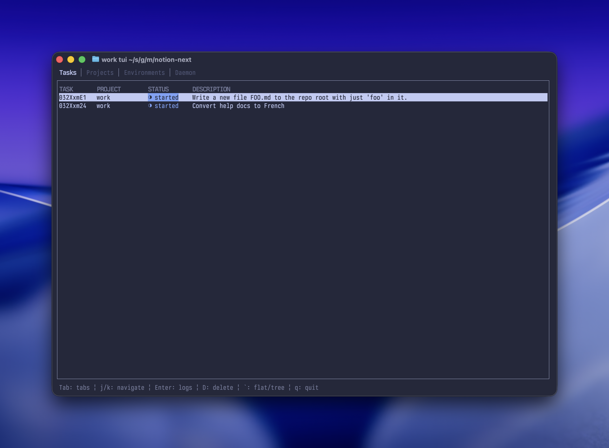

# work

A CLI for running parallel, isolated tasks against your projects.

`work` manages **projects**, **environments**, and **tasks**. Register a
project, and `work` can spin up isolated environments (git worktrees by
default) and run tasks in them via configurable providers. A background daemon
handles preparation and execution. A built-in TUI lets you monitor everything.



## Install

### Homebrew

```bash
brew install jclem/tap/work
```

### From source

```bash
cargo install --git https://github.com/jclem/work
```

## Quick start

```bash
# Start the daemon
work daemon start

# Or install as a launchd service (macOS)
work daemon install

# Register a project (defaults to cwd)
work project new

# Run a task
work task new "fix the login bug" --attach
```

## Configuration

Config lives at `$XDG_CONFIG_HOME/work/config.toml`. Edit with
`work config edit`.

```toml
environment-provider = "git-worktree"
task-provider = "claude"

[projects.backend]
environment-provider = "sandbox"
task-provider = "codex"

[daemon]
debug = false

[tasks.providers.claude]
type = "command"
command = "claude"
args = ["-p", "{task_description}"]

[environments.providers.sandbox]
type = "script"
command = "/path/to/sandbox-provider.sh"
```

Project overrides are optional. When you omit `--provider` / `--env-provider`,
`work` uses:
1. `projects.<project-name>.*-provider` (if set)
2. top-level `*-provider`

### Task providers

A task provider defines what command to run in your environment. The
`{task_description}` placeholder is replaced with the task description.
The environment provider sets the working directory.

```toml
[tasks.providers.claude]
type = "command"
command = "claude"
args = ["-p", "{task_description}"]
```

### Environment providers

The built-in `git-worktree` provider creates a git worktree per environment.
For custom isolation, write a script provider — see
[Custom environment providers](#custom-environment-providers).

## Custom environment providers

A script provider is an executable that receives an action as its first
argument and JSON on stdin. It writes JSON to stdout. Stderr is passed through.

Actions: `prepare`, `claim`, `update`, `remove`, `run`.

Here's an example that uses [Vercel Sandbox](https://vercel.com/docs/vercel-sandbox)
to run tasks in isolated cloud sandboxes:

```bash
#!/usr/bin/env bash
set -euo pipefail

action="$1"
input=$(cat)

case "$action" in
  prepare)
    project_path=$(echo "$input" | jq -r '.project_path')
    env_id=$(echo "$input" | jq -r '.env_id')

    sandbox_id=$(sandbox create --timeout "1h")

    # Copy project files into the sandbox
    tarball=$(mktemp -t project.XXXXXX.tar)
    git -C "$project_path" ls-files -z \
      | tar -C "$project_path" --null -T - -cf "$tarball"
    sandbox cp "$tarball" "${sandbox_id}:/tmp/project.tar"
    sandbox exec "$sandbox_id" -- mkdir -p /workspace
    sandbox exec "$sandbox_id" -- tar -xf /tmp/project.tar -C /workspace
    sandbox exec "$sandbox_id" -- rm /tmp/project.tar
    rm -f "$tarball"

    # Install and authenticate Codex inside the sandbox
    sandbox exec "$sandbox_id" -- npm i -g @openai/codex >&2
    sandbox exec "$sandbox_id" \
      --env OPENAI_API_KEY="$OPENAI_API_KEY" \
      -- bash -c 'echo $OPENAI_API_KEY | codex login --with-api-key' >&2

    jq -n --arg sid "$sandbox_id" '{sandbox_id: $sid}'
    ;;

  update|claim)
    echo "$input"
    ;;

  remove)
    sandbox_id=$(echo "$input" | jq -r '.metadata.sandbox_id')
    sandbox rm "$sandbox_id" || true
    ;;

  run)
    sandbox_id=$(echo "$input" | jq -r '.metadata.sandbox_id')
    command=$(echo "$input" | jq -r '.command')
    mapfile -t args < <(echo "$input" | jq -r '.args[]')
    exec sandbox exec "$sandbox_id" -w /workspace -- "$command" "${args[@]}"
    ;;

  *)
    echo "Unknown action: $action" >&2
    exit 1
    ;;
esac
```

### Provider protocol

| Action | stdin | stdout |
|---------|-------|--------|
| `prepare` | `{"project_name", "project_path", "env_id"}` | Arbitrary JSON metadata |
| `claim` | The stored metadata | Updated metadata |
| `update` | The stored metadata | Updated metadata |
| `remove` | `{"metadata": ...}` | (ignored) |
| `run` | `{"metadata": ..., "command": "...", "args": [...]}` | (exec the process) |

The JSON returned by `prepare` is stored as the environment's metadata and
passed to all subsequent actions.

## Commands

```
work project new [name] [--path PATH]   Register a project
work project list [--format FORMAT]     List projects
work project rm NAME                    Remove a project

work task new DESC [--provider P]       Create and run a task
  [--env-provider P] [--attach]
work task list [--format FORMAT]        List tasks
work task rm ID                         Remove a task and its environment

work task logs ID [--follow]            View task output
work env logs ID [--follow]             View environment provider output

work env create [--provider P]          Create and claim an environment
work env prepare [--provider P]         Prepare an environment (pool it)
work env claim [ID]                     Claim a pooled environment
work env update ID                      Update a pooled environment
work env rm ID                          Remove an environment
work env list [--format FORMAT]         List environments
work env provider list                  List available providers

work tui                                Open the terminal UI
work config edit                        Edit config in $EDITOR
work daemon start [--force]             Start the daemon
work daemon install                     Install as launchd service
work daemon uninstall                   Uninstall launchd service
work completions SHELL                  Generate shell completions
```

Output formats: `human` (default), `plain` (tab-separated), `json`.

## Architecture

`work` runs a daemon that listens on a Unix socket. The CLI communicates with
it over HTTP. Environments are prepared and tasks executed asynchronously via a
job queue. State is stored in SQLite.

```
$XDG_DATA_HOME/work/         Data (database, worktrees, logs)
$XDG_CONFIG_HOME/work/       Configuration
$XDG_RUNTIME_DIR/work/       Runtime (socket, pidfile)
$XDG_STATE_HOME/work/        Daemon logs (when using launchd)
```

## Shell completions

```bash
work completions bash
work completions zsh
work completions fish
```
